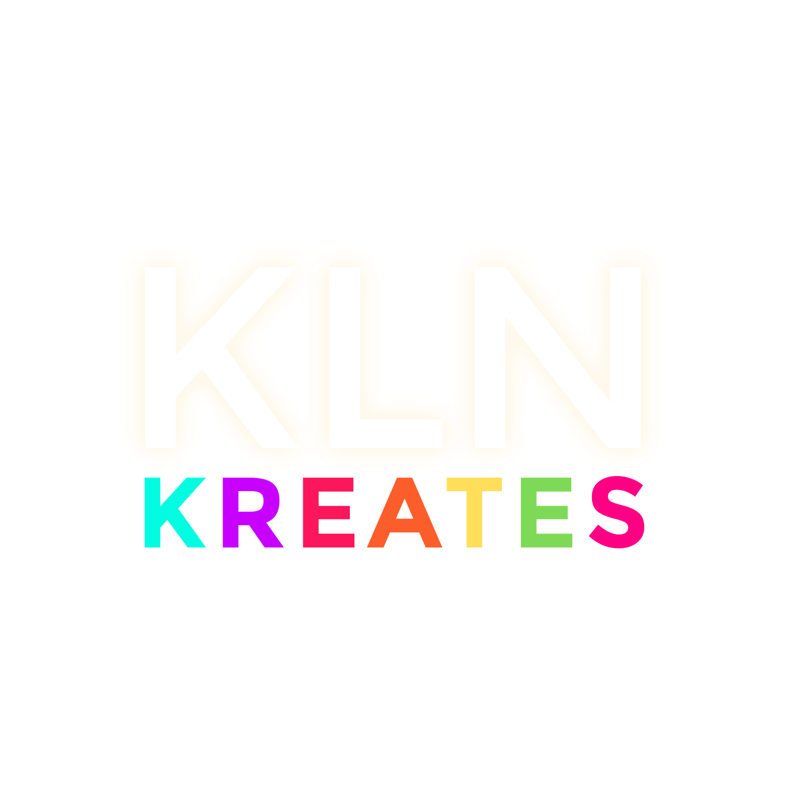

<a name="readme-top">

<br/>

<br />
<div align="center">
  <a href="https://github.com/Pudgeeba">
  <!-- TODO: If you want to add logo or banner you can add it here -->
    
  </a>
<!-- TODO: Change Title to the name of the title of your Project -->
  <h3 align="center">Seatwork 4: Features Section</h3>
</div>
<!-- TODO: Make a short description -->
<div align="center">
  This project is for showcasing creativity through different HTML and CSS skills that has been applied to 1 landingpage, and 2 different Features designs.
</div>

<br />

<!-- TODO: Change the zyx-0314 into your github username  -->
<!-- TODO: Change the WD-Template-Project into the same name of your folder -->


---

<br />
<br />

<!-- TODO: If you want to add more layers for your readme -->
<details>
  <summary>Table of Contents</summary>
  <ol>
    <li>
      <a href="#overview">Overview</a>
      <ol>
        <li>
          <a href="#key-components">Key Components</a>
        </li>
        <li>
          <a href="#technology">Technology</a>
        </li>
      </ol>
    </li>
    <li>
      <a href="#rule,-practices-and-principles">Rules, Practices and Principles</a>
    </li>
    <li>
      <a href="#resources">Resources</a>
    </li>
  </ol>
</details>

---

## Overview

<!-- TODO: To be changed -->
<!-- The following are just sample -->
 This Website's Theme is inspired by my small jewelry business. This is to showcase creativity through different HTML and CSS skills that has been applied to 2 different features display designs and a landing page. Each Features Display will contain a different style such as featuring a product, an event, and perhaps it can even feature a celebrity!
Throughout this whole project, I was able to come up and play with different designs and styles that is very appealing to the eye. This project also led me to another purpose which is being able to use it for commision purposes!


### Key Components
<!-- TODO: List of Key Components -->
<!-- The following are just sample -->

- MultiPage Website
- Hover Effect
- Cards Design
- Features design
- Interactive Elements

### Technology
<!-- TODO: List of Technology Used -->


## Rules, Practices and Principles
1. Always use WD- in the front of the Title of the Project for the Subject followed by your custom naming.
2. Do not rename any .html files; always use index.html as the filename.
3. Place Files in their respective folders.
4. All file naming are in camel case.
   - Camel case is naming format where there is no white space in separation of each words, the first word is in all lower case while the succeding words first letter are in upper followed by lower cased letters.
   - ex.: buttonAnimatedStyle.css
5. Use only External CSS.
6. Renaming of Pages folder names are a must, and relates to what it is doing or data it holding.
7. File Structure to follow below.

```
WD-ProjectName
└─ assets
|   └─ css
|   |   └─ style.css
|   └─ img
|   |   └─ fileWith.jpeg/.jpg/.webp/.png
|   └─ js
|       └─ script.js
└─ pages
|  └─ pageName
|     └─ assets
|     |  └─ css
|     |  |  └─ style.css
|     |  └─ img
|     |  |  └─ fileWith.jpeg/.jpg/.webp/.png
|     |  └─ js
|     |     └─ script.js
|     └─ index.html
└─ index.html
└─ readme.md
```

## Resources

<!-- TODO: Add References -->
| Title         | Purpose  | Link                       |
| ------------- | -------- | ---------------------------|
| W3School      | HTML/CSS guide | https://www.w3schools.com/ |
| CodeSweetly   | HTML/CSS guide | https://codesweetly.com/   |
| Google Fonts  | Fonts    | https://fonts.google.com/  |
| Stackoverflow | HTML/CSS guide | https://stackoverflow.com/ |
| Google        | HTML/CSS guide | https://www.google.com.ph/ |
| Wordpress     | to get my website link     | https://adhikraftsminimalisttrinketsbyklaineandrea.art.blog/?fbclid=IwAR1LqfeNxXArAPi0hBfP8pkQA4gNvNa97mhxxsEfhAExwJGCm16lbLtewkw     |
| Instagram     | to link my business account  | https://www.instagram.com/adhikrafts.mtbka?utm_source=ig_web_button_share_sheet&igsh=ZDNlZDc0MzIxNw==     |
| Facebook      | to link my business page   | https://www.facebook.com/adhikrafts.mtbka?mibextid=ZbWKwL     |
